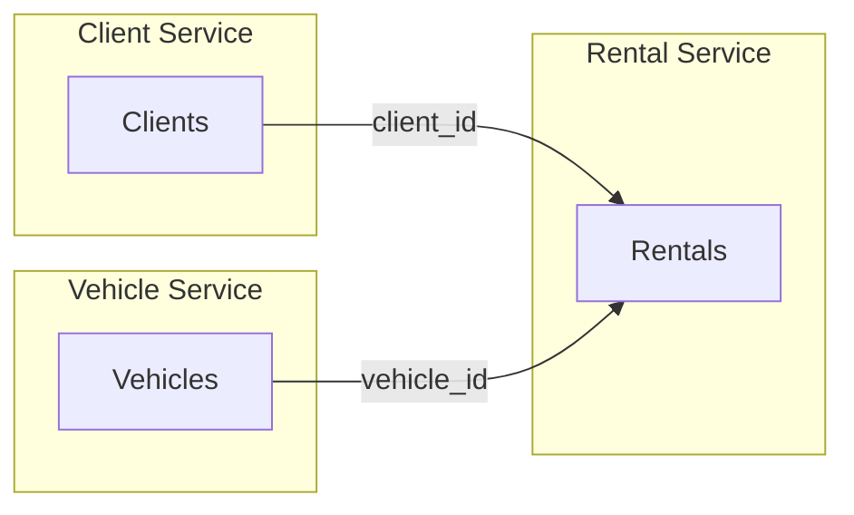

# Rental Service

Core service responsible for rental operations in the Car Rental system.

This service defines the business rules and orchestrates interactions
between Client and Vehicle services.

---

## Architecture

## Table: Rentals

| Column         | Type     | Description                    |
|----------------|----------|--------------------------------|
| id             | int      | Unique identifier              |
| client_id      | int      | Reference to Client            |
| vehicle_id     | int      | Reference to Vehicle           |
| pickup_date    | datetime | Rental start date              |
| return_date    | datetime | Return date                    |
| status         | int      | Normal / Cancelled             |

### Explanation

Normal → Rental is following the expected life cycle
cancelled → Rental was terminated before completion  

### Derived state

- Active   → status = normal AND return_date IS NULL  
- Finished → status = normal AND return_date IS NOT NULL  
- Cancelled → status = cancelled 

### External events:

Client blocked → cancelled
Vehicle under maintenance → cancelled

## Related Services

- Client Service: https://github.com/AmonAmarth2003/car-rental-client-service
- Vehicle Service: https://github.com/mateusinacion/car-rental-veiculos-servico